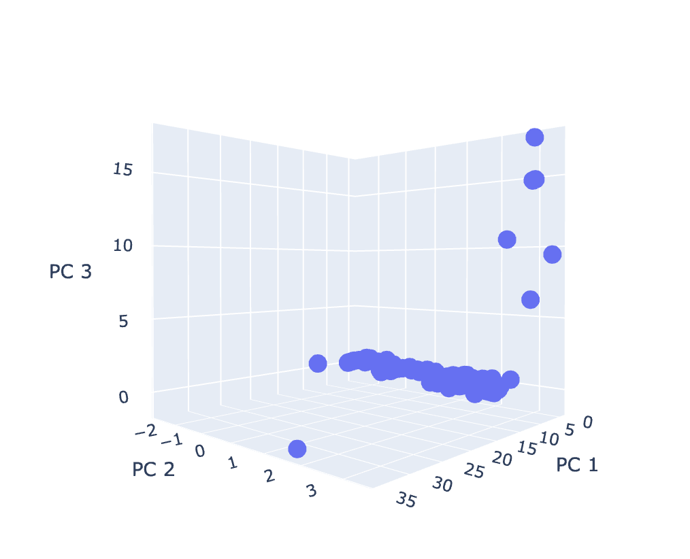
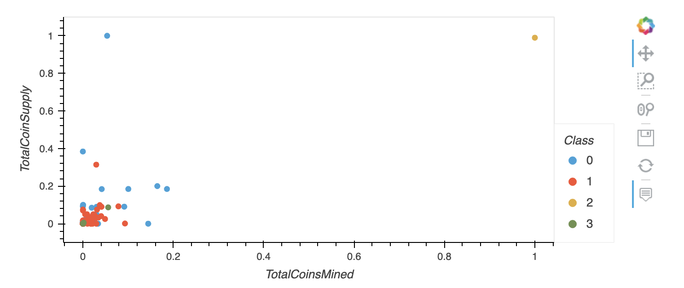
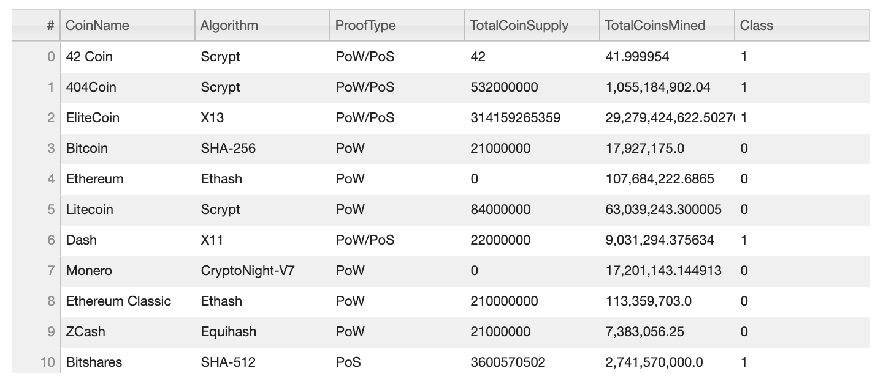

# Cryptocurrencies

This analysis uses an unsupervised machine learning model to find similarities between all available cryptocurrencies currently being traded on the market. The goal of the analysis is to create a classification system for cryptocurrencies for an investment bank that is wanting to offer cryptocurrency investment portfolios to its clients, but is unfamiliar with the space and needs some initial direction. We use an unsupervised machine learning model because we don't know exactly what we are looking for. We are not performing this analysis to find how our cryptocurrencies fit within certain relationships or labels that we provide the model. Instead, we want the model to show us the best ways to classify the crypto on its own. 
 
 
The data from CryptoCompare contains the following columns for each cryptocurrency: `CoinName`, `Algorithm`, `IsTrading`, `ProofType`, `TotalCoinsMined`, and `TotalCoinSupply`. We preprocess the dataset into one that is best for the machine learning model. To do this, we transform all data to numerals using the Pandas `get_dummies()` method so the data can be used by the model. We also scale all values using the `StandardScaler` module. This is because the values in our dataset have extremely large ranges. We scale all values so that they are all weighted the same by the model. 
We use the statistical technique of Principal Component Analysis (PCA) because after the preprocessing stage, we have 98 columns (input features or dimensions) in our dataset that the machine learning model will need to explore. We use PCA to reduce these to three dimensions while keeping as much relevant information as possible. Once we have our three principal components, we use an elbow curve to determine the best number of clusters (or categories) of our data. Our elbow curve showed 4 to be the best number of clusters to use for our model. We use the `K-Means` to model our data (using k = 4) and make the cluster predictions.
 
 
Lastly, we provide two visualizations using `Plotly.express` and Pandas `hvPlot`. The first visualization shows a 3D model of the cryptocurrencies are against the three principal components.

 We also created a visualization of the classes (clusters) against the scaled values of `TotalCoinsMined` and `TotalCoinSupply`. Most of our cryptocurrencies are on the lower end of both number mined and supply. 

We also provided a table using `hvplot` that shows all the `CoinName`, `Algorithm`, `ProofType`, `TotalCoinSupply`, `TotalCoinsMined`, `Class`. This shows all of the data from our original dataset with the class (or cluster) our model assigned each cryptocurrency. 

As an exploratory exercise using unsupervised machine learning model, this analysis provides our investment bank an idea of how the cryptocurrencies can be clustered and gives them some information to provide their clients. 